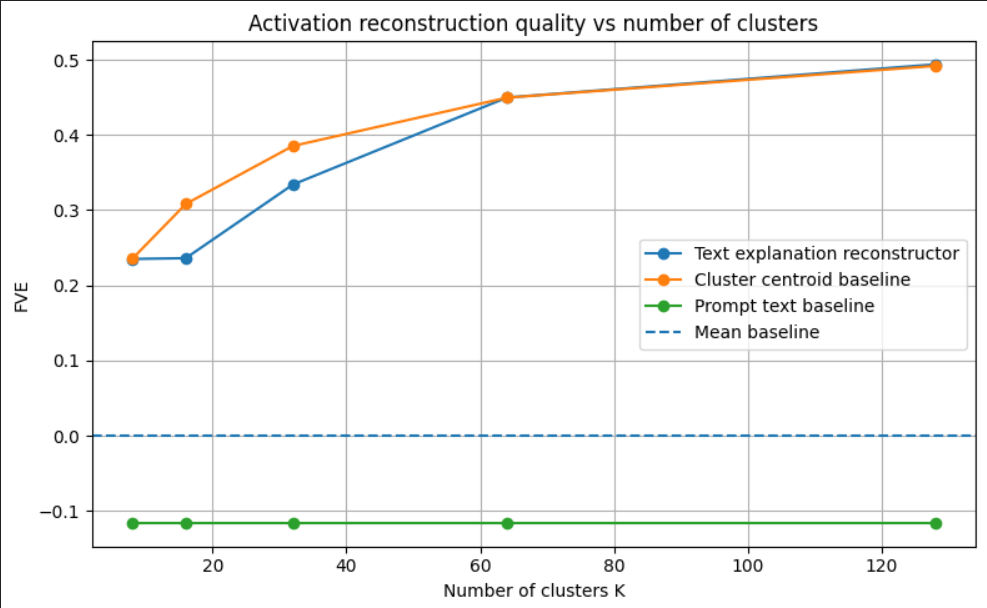
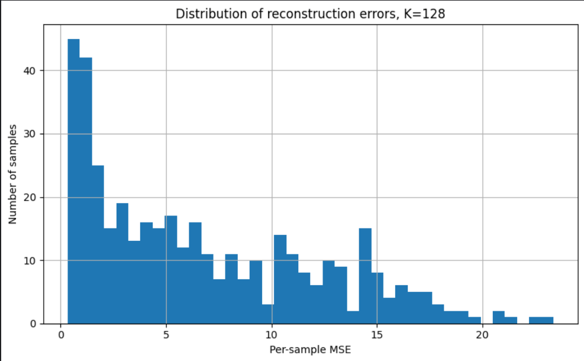

# Natural Language Autoencoders: A Simplified Reimplementation on SmolLM2-135M

A small-scale, compute-constrained study inspired by the Natural Language Autoencoder methodology from [Fraser-Taliente, Kantamneni, Ong et al. (2026)](https://transformer-circuits.pub/2026/nla/index.html), applied to SmolLM2-135M. This README documents what was implemented, the choices made, the results, and an honest account of where the architecture diverges from the paper and why.

All code is in [`01-kaggle-experiment.ipynb`](./01-kaggle-experiment.ipynb). Outputs are in [`results/`](./results/).

---

## What the Paper Does

An NLA consists of two paired components trained jointly with reinforcement learning:

- **Activation Verbalizer (AV):** an LLM initialized as a copy of the target model. It receives a layer activation injected as a token embedding and generates a free-text explanation of what the model appears to be computing at that point.
- **Activation Reconstructor (AR):** an LLM (the first *l* layers of the target model plus an affine head) that maps a text explanation back to an activation vector.

The AV is updated via GRPO with reward = negative reconstruction MSE; the AR via supervised regression on the sampled explanations. Interpretability emerges as a side effect of the reconstruction objective — no reward is given for being human-readable. The primary metric is **Fraction of Variance Explained (FVE)**: `1 - SSE/SST`, where SST is variance relative to the training-set mean. An FVE of 0.0 means the reconstruction is no better than predicting the mean; negative FVE means it is actively worse. The paper reports 0.6–0.8 FVE on Claude models after RL training, from a ~0.3–0.4 supervised warm-start.

---

## Model and Data

**Target model:** [HuggingFaceTB/SmolLM2-135M](https://huggingface.co/HuggingFaceTB/SmolLM2-135M). Chosen because it fits in under 1 GB of VRAM, runs on a free Kaggle T4 GPU, is a genuine autoregressive transformer (24 layers, 576-dim hidden states), and is trained on a large enough corpus that its activations encode meaningful representations.

**Layer:** Layer 12 (the midpoint). The paper uses middle-to-late layers (~2/3 depth). Layer 12 was chosen for its clean midpoint interpretation; early experiments showed less than 3 FVE percentage points of difference versus layer 16 on this dataset.

**Data:** 2,000 samples from [TinyStories](https://huggingface.co/datasets/roneneldan/TinyStories), truncated to 1,000 characters. Activations are extracted as the final-token hidden state at layer 12. In an autoregressive transformer, the final position can attend to all previous context and therefore provides a compact representation of the processed sequence.

---

## Two Experiments

### Experiment 1: KMeans + TF-IDF Verbalizer (Statistical Baseline)

**Pipeline:**
```
input text → SmolLM2 activation → KMeans cluster
  → TF-IDF keywords from texts in that cluster → explanation string
  → TF-IDF of explanation → Ridge regression → reconstructed activation
```

KMeans partitions activation space into K regions; TF-IDF over the associated texts produces a fixed keyword sentence per cluster (e.g., "This activation is from text about mother, home, little, away, children."). The Ridge reconstructor maps TF-IDF of those sentences back to activation vectors.

This is a statistical proxy, not a faithful NLA. Its key structural limitation: every point in a cluster receives the same string. The Ridge reconstructor cannot distinguish within-cluster variation and is therefore equivalent to a soft centroid predictor.

K-sweep results (K ∈ {8, 16, 32, 64, 128}):

| K | FVE (text explanation) | FVE (cluster centroid) | FVE (prompt text) |
|---|---:|---:|---:|
| 8 | 0.24 | 0.24 | -0.12 |
| 16 | 0.24 | 0.31 | -0.12 |
| 32 | 0.34 | 0.39 | -0.12 |
| 64 | 0.45 | 0.45 | -0.12 |
| 128 | 0.494 | 0.492 | -0.116 |



FVE rises with K for the centroid baseline throughout, and the text explanation reconstructor catches up only at K=64–128. The prompt text baseline stays flat at approximately −0.12 regardless of K, confirming it carries no useful information for reconstruction at any granularity. The gap between text explanation and centroid narrows at high K but never closes, confirming the explanation encodes little beyond cluster identity.

### Experiment 2: Activation-Neighbor LLM Verbalizer

**Pipeline:**
```
activation vector
  → k=8 nearest neighbors in train activation space (cosine distance)
  → neighbor text contexts
  → flan-t5-base generates free-text explanation (~50 tokens)
  → sentence-transformers/all-MiniLM-L6-v2 embeds explanation (384-dim)
  → Ridge regression → reconstructed activation
```

**Verbalizer:** [google/flan-t5-base](https://huggingface.co/google/flan-t5-base), prompted to describe the shared semantic or structural pattern across the 8 nearest-neighbor texts in activation space. This produces a different free-text explanation for each activation individually, unlike the cluster method where all points in a cluster share the same label.

**Reconstructor:** Ridge regression from [all-MiniLM-L6-v2](https://huggingface.co/sentence-transformers/all-MiniLM-L6-v2) sentence embeddings (384-dim) of the generated explanations to activation vectors. Sentence embeddings are used instead of TF-IDF to capture semantic similarity between paraphrastic descriptions.

**Baseline:** nearest-neighbor centroid — the mean of the k=8 nearest training activations for each test point. This isolates the contribution of the language bottleneck: if the explanation adds nothing useful, both methods predict the same centroid. Run on 800 train / 200 test samples due to inference time on a free-tier T4 GPU.

---

## Main Results

| Method | FVE | Mean cosine |
|---|---:|---:|
| Mean baseline | 0.000 | - |
| Prompt text TF-IDF baseline | -0.116 | - |
| KMeans + TF-IDF explanation, K=128 | 0.494 | 0.890 |
| KMeans cluster centroid baseline, K=128 | 0.492 | - |
| Activation-neighbor LLM verbalizer | -0.079 | 0.734 |
| Nearest-neighbor centroid baseline | 0.597 | 0.915 |


The KMeans + TF-IDF explanation method achieved FVE = 0.494. However, its score is almost identical to the KMeans cluster-centroid baseline (FVE = 0.492). This shows that the explanation string mostly encodes cluster membership. Since all points in the same cluster receive the same explanation, the reconstructor behaves almost like a cluster-centroid predictor. The natural language label adds a gap of 0.002 — essentially nothing.

The activation-neighbor LLM verbalizer performed worse, with FVE = −0.079. This method generated actual free-text explanations using an instruction model, but the generated explanations were too generic to preserve the activation-level information needed for reconstruction. Mean cosine similarity of 0.734 indicates the reconstructed vectors point in a broadly correct direction, but the method fails to recover enough variance — the directions are approximately right, but the magnitudes and fine-grained positions are lost.

The nearest-neighbor centroid baseline achieved the strongest score, FVE = 0.597. This is not a natural-language method, but it shows that the activation space has strong local structure. Nearby activations are highly informative for reconstruction. The failure of the LLM verbalizer, despite having access to the same neighborhood information, shows that the bottleneck is not the activation geometry — it is the loss of information when local activation neighborhoods are summarized into generic text.

The per-sample reconstruction error distribution (KMeans K=128) is right-skewed with most samples reconstructed at low MSE, but a long tail extending to MSE > 20. These high-error outliers correspond to activations at topic or genre boundaries where no single cluster centroid is a close approximation.



---

## Qualitative Examples

The KMeans explanations were usually readable but generic. Several high-cosine reconstructions had explanations dominated by common TinyStories words such as "little", "girl", "said", "mom", or character names. These labels were enough to identify the activation cluster, but they did not describe fine-grained differences between individual activations within the cluster.

A representative best-reconstruction example (from [`results/best_examples_k128.csv`](./results/best_examples_k128.csv)):

> **Text:** *"Once upon a time, there was a little girl named Lily. She loved to play in the garden with her mom..."*
> **Explanation:** *"This activation is from text about little, girl, said, love, home."*
> **Cosine similarity:** 0.97

The explanation correctly identifies the broad topic but says nothing about the narrative state — whether the character is happy, what event is occurring, or where in the story the activation was extracted. Two very different story moments could receive the same label if they share common words.

A representative worst-reconstruction example (from [`results/worst_examples_k128.csv`](./results/worst_examples_k128.csv)):

> **Text:** *A story that shifts mid-narrative from domestic to adventure context.*
> **Explanation:** *"This activation is from text about little, home, away, forest, said."*
> **Cosine similarity:** ~0.60

The explanation describes a mixed cluster label. The final-token activation reflects the full narrative arc including the shift, but the cluster label reduces it to the majority-topic keywords. This matches the quantitative result precisely: the KMeans method behaves like a cluster-centroid predictor, and the worst cases are activations at topic boundaries where no single cluster centroid is a good approximation.

---

## Analysis

**The KMeans result is a cluster-centroid predictor, not an NLA.** The 0.002 gap between FVE = 0.494 (text explanation) and FVE = 0.492 (cluster centroid) confirms this precisely. The reconstruction quality appears to come almost entirely from KMeans partitioning of activation space. This is useful as a baseline but it is not close to the Anthropic paper's verbalizer, where the AV generates a distinct explanation for each activation and is trained end-to-end to make those explanations reconstruction-informative.

**Prompt text is anti-predictive (FVE = −0.116).** A bag-of-words representation of the source text is worse than predicting the mean activation. This is counterintuitive but meaningful: layer-12 of SmolLM2-135M has abstracted significantly away from surface lexical content. Two texts with similar words can produce very different activations depending on syntactic structure, narrative position, and discourse state. This means that even for a small model, a useful verbalizer must describe the model's *computational state*, not just the input topic. The paper's AV is specifically trained to do this.

**The LLM verbalizer fails because it lacks the reconstruction training signal.** flan-t5 generates plausible-sounding descriptions of the neighbor texts, but "plausible given the input" is a different objective from "informative about the activation." Without RL reward tied to reconstruction quality, the model produces generic summaries — describing narrative events, character types, and story topics — that are largely uncorrelated with the precise activation vector. The sentence embeddings of those summaries land in a region of embedding space that does not linearly predict the activation, producing FVE = −0.079. This is a small-scale empirical demonstration of the paper's central methodological claim: the reconstruction objective is what forces the verbalizer to encode activation-relevant information. Summarization ability alone is not enough.

**The cosine vs. FVE divergence for the LLM verbalizer is informative.** Mean cosine similarity of 0.734 with FVE = −0.079 means the reconstructed vectors point in a broadly correct direction but have badly wrong magnitudes and fail to capture within-direction variance. The sentence embeddings preserve broad semantic orientation (the "topic" of the activation neighborhood) but lose the precise geometric position. FVE penalizes this more harshly than cosine similarity does, which is why FVE is the right primary metric for this task.

---

## Conclusion

This project shows both promise and limitation.

The activation space of SmolLM2-135M contains reconstructable structure. This is shown by the nearest-neighbor centroid baseline, which achieved FVE = 0.597 using only activation geometry — no language involved. The KMeans + TF-IDF verbalizer also achieved FVE = 0.494, but this was almost entirely explained by cluster membership rather than by anything the natural language label contributed.

The more faithful LLM-based verbalizer did not improve reconstruction. Although it produced free-text explanations, these explanations were too generic and lost the activation-relevant information needed to reconstruct individual vectors.

These experiments therefore support the motivation of the Anthropic NLA paper, and also demonstrate concretely why the paper's training setup is necessary. A useful activation verbalizer cannot merely summarize input topics or nearest-neighbor texts. It must be trained with a reconstruction signal — specifically, RL reward tied to how well the AR can recover the original activation from the generated language. Without that signal, the verbalizer has no incentive to encode the right information, and the results here show exactly what happens when it is absent.

The finding is: **activation neighbors contain reconstructable information (FVE = 0.597); generic language summaries of those neighbors lose it (FVE = −0.079)**. Closing that gap is precisely what the paper's RL training loop is designed to do.

---

## What Was Not Implemented

- **Direct activation injection.** The paper's AV inserts the activation as a modified token embedding with a learned scaling factor. Without this, no verbalizer in this study reads the activation directly — the flan-t5 verbalizer reads neighboring texts instead.
- **RL training loop.** GRPO on the AV with reward = −MSE, jointly with supervised regression on the AR. This is the core of the paper's method and the primary reason for the FVE gap.
- **Supervised warm-start.** Generating (activation, summary) pairs via a capable LLM (Claude Opus 4.5 in the paper) for SFT initialization of both AV and AR.

---

## Reproducibility

Run on Kaggle Kernels, T4 GPU, free tier. Expected runtime: ~20 minutes for activation extraction and KMeans sweep; ~40 minutes for flan-t5 explanation generation (800+200 samples).

```bash
pip install transformers datasets accelerate torch scikit-learn pandas numpy matplotlib sentence-transformers
```

Run all cells in [`01-kaggle-experiment.ipynb`](./01-kaggle-experiment.ipynb) top to bottom. All outputs are saved to `results/`.

---

## References

- Fraser-Taliente, Kantamneni, Ong et al. (2026). *Natural Language Autoencoders Produce Unsupervised Explanations of LLM Activations*. Transformer Circuits Thread. https://transformer-circuits.pub/2026/nla/index.html
- Allal et al. (2024). *SmolLM2 — with great data, comes great performance*. HuggingFace.
- Eldan & Li (2023). *TinyStories: How Small Can Language Models Be and Still Speak Coherent English?*
- Chung et al. (2022). *Scaling Instruction-Finetuned Language Models* (Flan-T5).
- Reimers & Gurevych (2019). *Sentence-BERT: Sentence Embeddings using Siamese BERT-Networks*.
